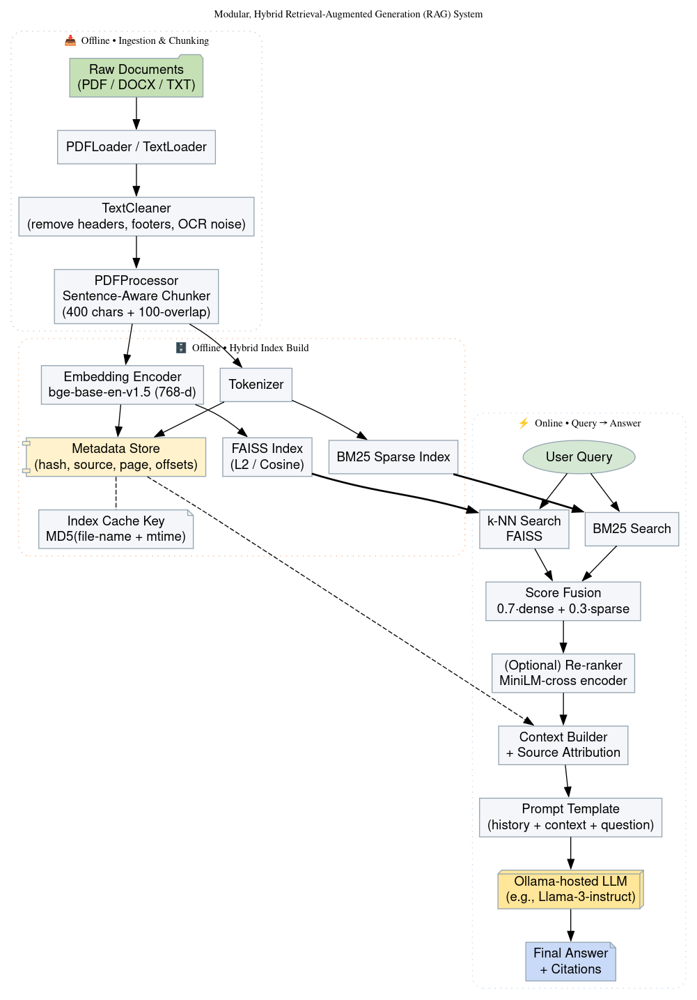

# 🏗️  Modular Hybrid-RAG System

A local-first Retrieval-Augmented Generation (RAG) stack that lets you **query your private PDFs with citations**.  
It fuses **FAISS dense vectors** (BAAI bge-base-en-v1.5) with **BM25 sparse keywords**, then feeds the top chunks to an **Ollama-hosted LLM** (default: `llama3`) for answer generation.

<p align="center">
  
</p>

---

## ✨  Features

| Layer | Highlights |
|-------|------------|
| **Ingestion** | Sentence-aware chunking (400 chars + 100 overlap) with page/offset tracking |
| **Index** | Hybrid: FAISS cosine **+** rank\_bm25 • smart disk cache |
| **Retrieval** | Weighted fusion `0.7 · dense + 0.3 · sparse` • optional cross-encoder re-rank |
| **Generation** | Ollama API • conversation history • explicit source tags |
| **Privacy** | Everything—including the model—can run 100 % offline |

---

## 🛠️  Quick-start (≈15 min)

```bash
# 1. Clone
git clone https://github.com/<your-user>/hybrid-rag.git
cd hybrid-rag

# 2. Python env
python -m venv .venv && source .venv/bin/activate
pip install -r requirements.txt          # see list below

# 3. Ollama (first time only)
curl -fsSL https://ollama.com/install.sh | sh    # macOS / Linux
ollama pull llama3                               # 4-8 GB download

# 4. Add PDFs
mkdir -p docs && cp ~/MyPapers/*.pdf docs/

# 5. Fire it up
python -m rag_system.main                        # builds index, opens REPL
````

**Need to rebuild the index after adding files?**

```bash
python -m rag_system.main rebuild
```

---

## 🧩  Repository layout

| Path                            | Purpose                                                       |
| ------------------------------- | ------------------------------------------------------------- |
| `rag_system/config.py`          | Centralised settings (chunk size, model IDs, Ollama URL, …)   |
| `rag_system/data_processing.py` | PDF loading + smart chunking                                  |
| `rag_system/indexing.py`        | Builds/loads FAISS & BM25; handles on-disk cache              |
| `rag_system/retrieval.py`       | Dense search, sparse search, score fusion, (optional) re-rank |
| `rag_system/generation.py`      | Prompt templating & Ollama calls with retries                 |
| `rag_system/pipeline.py`        | High-level orchestrator used by CLI                           |
| `rag_system/main.py`            | Interactive terminal app / REPL                               |

---

## ⚙️  Configuration

Open `rag_system/config.py` and tweak to suit:

| Key                 | Default                 | Description                                |
| ------------------- | ----------------------- | ------------------------------------------ |
| `PDF_DIR`           | `./docs`                | Folder containing your PDFs                |
| `EMBEDDING_MODEL`   | `BAAI/bge-base-en-v1.5` | Sentence-Transformers model                |
| `OLLAMA_MODEL`      | `llama3`                | Any model you’ve pulled with `ollama pull` |
| `TOP_K_RETRIEVAL`   | `5`                     | Chunks retrieved per modality              |
| `USE_HYBRID_SEARCH` | `True`                  | Set `False` for dense-only search          |

---

## 🐳  One-liner Docker (optional)

```bash
docker build -t rag-local .
docker run -p 11434:11434 -it rag-local   # exposes Ollama + REPL
```

The Dockerfile pre-installs FAISS, Ollama, and copies sample PDFs.

---

## 🔍  Asking questions

Inside the REPL:

```
🤔 Your question: What is the main contribution of paper X?
🔍 Searching and generating answer...
💡 Answer:
<generated text>
📖 Sources:
1. PaperX.pdf (Page 3) — Score 0.83
2. PaperY.pdf (Page 7) — Score 0.76
```

---

## 🗑️  Cache & logs

* `.cache/` — FAISS index, BM25 matrix, metadata (delete to force full rebuild)
* `rag_system.log` — timestamped logs (set level in `main.py`)

---

## 🧱  Dependencies (`requirements.txt`)

```
faiss-cpu>=1.7
sentence-transformers>=2.5
rank-bm25>=0.2
pymupdf>=1.23
nltk>=3.8
numpy
tqdm
requests
```

NLTK will auto-download tokenizers/stop-words at first run.

---

## 🤔  FAQ

| Question                      | Answer                                                                                                 |
| ----------------------------- | ------------------------------------------------------------------------------------------------------ |
| **Can I swap the LLM?**       | Yes — change `config.OLLAMA_MODEL = "phi3"` (or any Ollama model).                                     |
| **Docs in another language?** | Use a multilingual embedding model like `sentence-transformers/paraphrase-multilingual-MiniLM-L12-v2`. |
| **Empty answers?**            | Ensure the index contains text; check PDFs didn’t OCR-fail.                                            |

---

## 🙏  Contributing & Feedback

If this project helps you, **please star the repo**, open issues, or submit PRs.
And if you use it in your own work, **cite the project** so others can find it, and leave feedback so we can make it even better!

```

---

### Copy instructions

1. Click into the code block above.  
2. Select all (`Ctrl/Cmd + A`) → copy.  
3. Paste into a new `README.md` file in your repo root.  
4. Add the `docs/img/rag_architecture.png` image (or update the path).  
5. Commit + push—done!
```
